## About
This lab guide section covers provisioning of resources for the lab.  Please follow the steps carefully, and sequentially to ensure you dont run into issues.
 
## 1.0. Provision a resource group
1. Logon to the Azure portal (portal.azure.com), and sign-in to your Azure subscription 
2. Create a resource group as shown in the screenshots below 
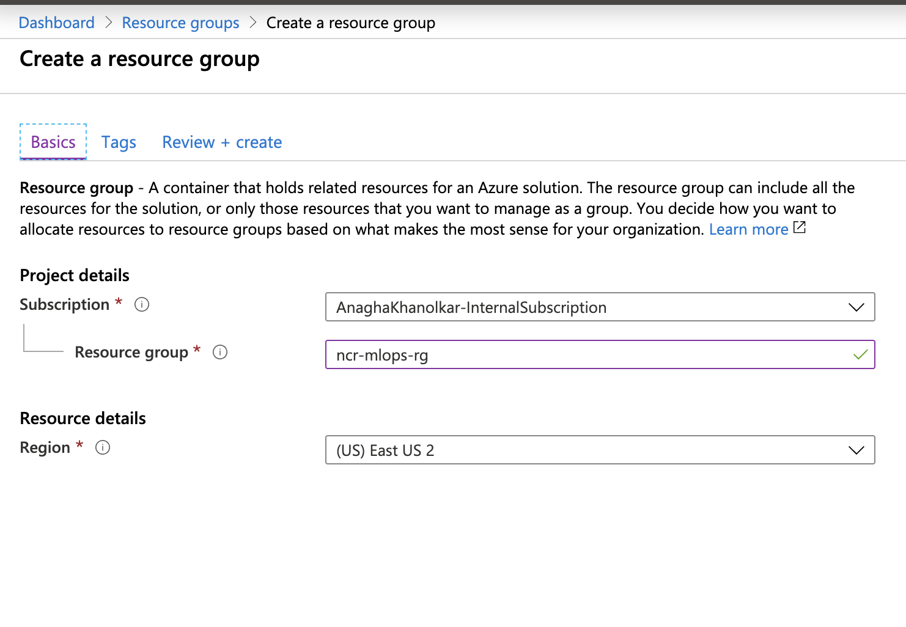
 

 

## 2.0. Provision an Azure Machine Learning Service instance
1.  Navigate into the resource group from #1.0.2 above 
2.  Click on "+ Add" and type "Azure Machine Learning" 
3.  Follow the steps below to provision the service 
Ensure you pick the same region as your resource group   

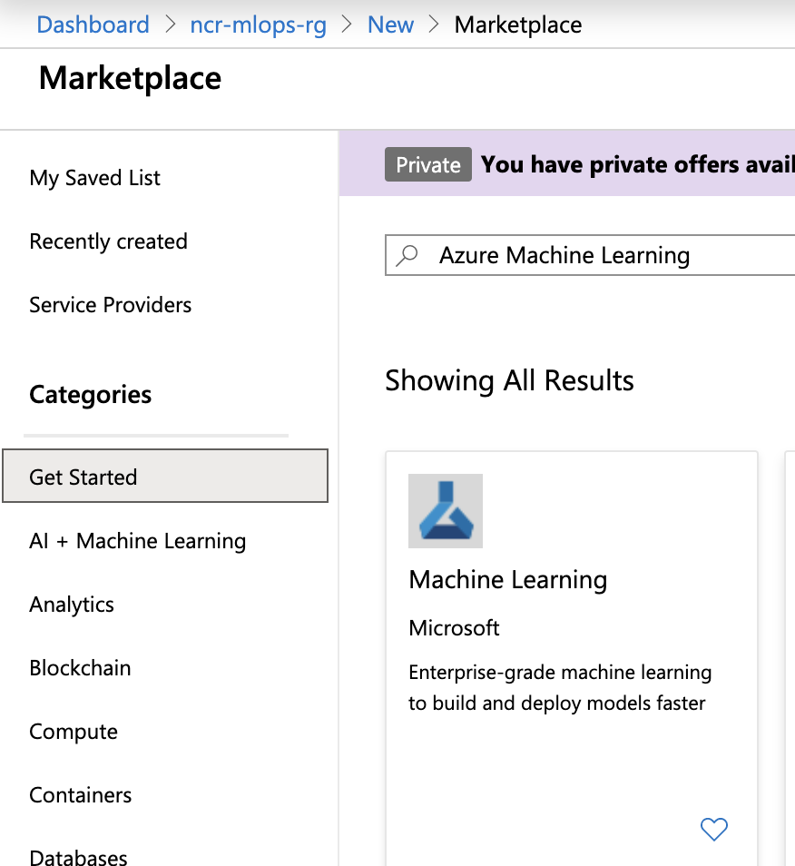
 

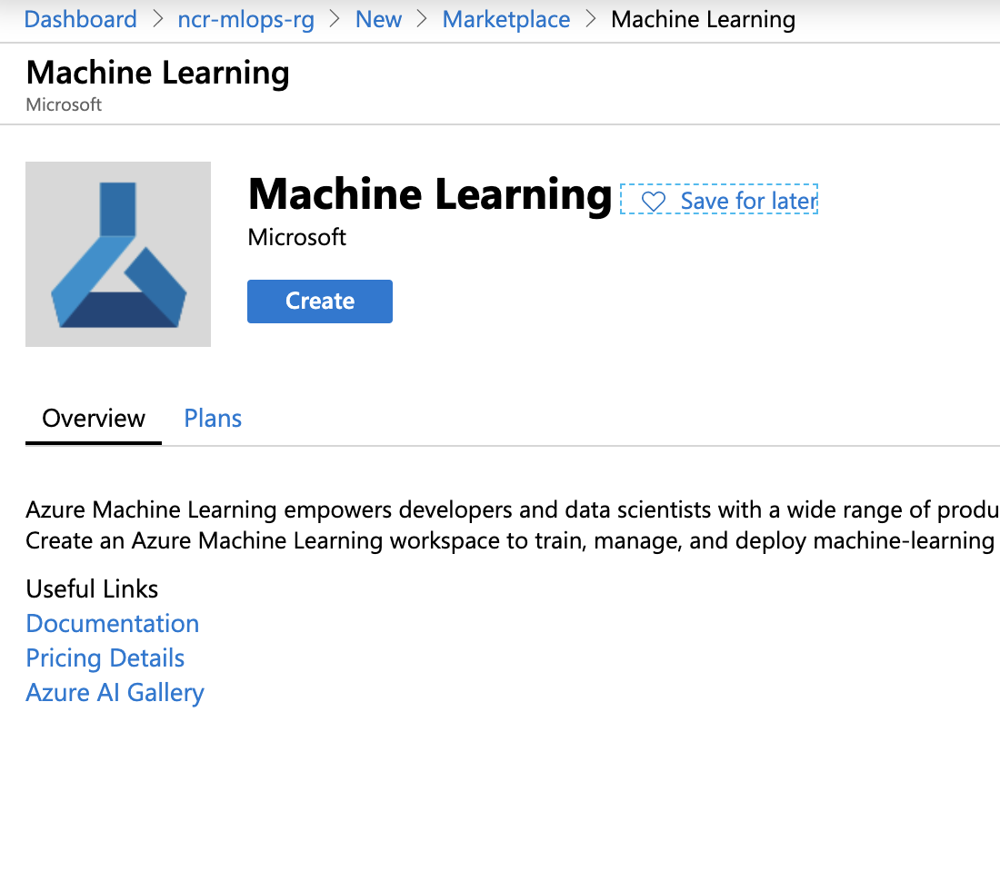
 

Click create 
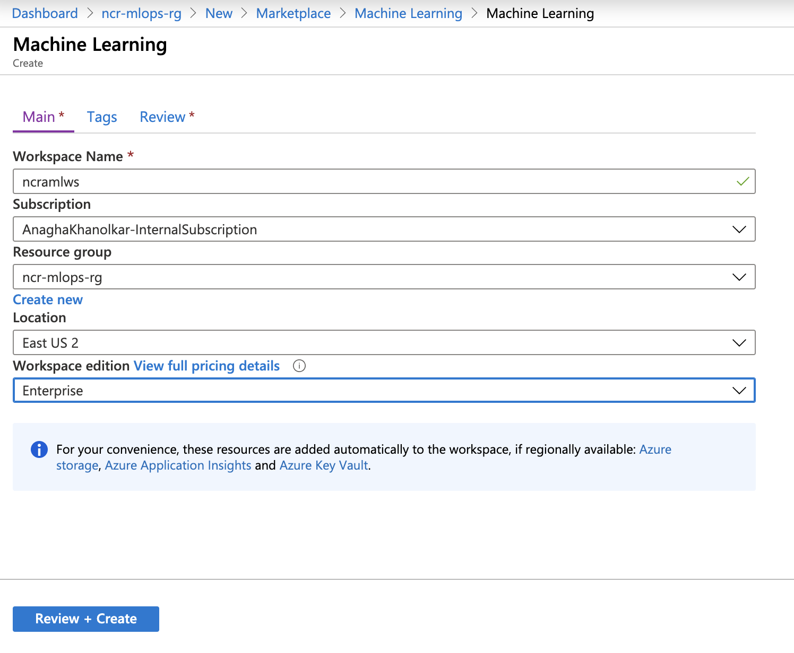
 

Enter the details and click n "create" 
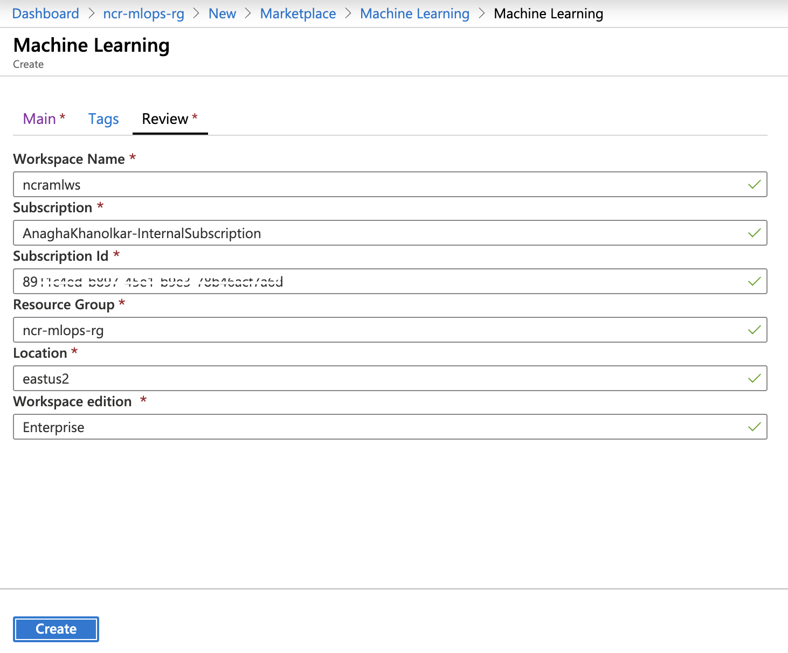
 

You should see this... 
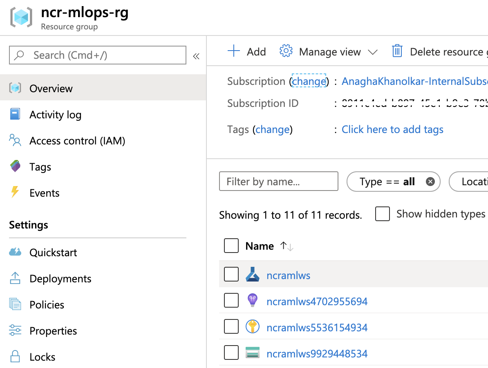
 

 

## 3.0. Provision a Storage Account (blob storage)
Note: We are using blob storage in this lab for simplicity. 
We are also not using the AML dataset abstraction for the same reason.   
For an actual project, consult your Microsoft CSA for guidance.  

1.  Navigate into the resource group from #1.0.2 above 
2.  Click on "+ Add" and type "Storage Account" 
3.  Follow the steps below to provision the service 
Note - Storage account names are globally unique so you will not be able to use the exact same name as mine.  Consider a suffix that you can easily remember and add it to the name. 
Ensure you pick the same region as your resource group   

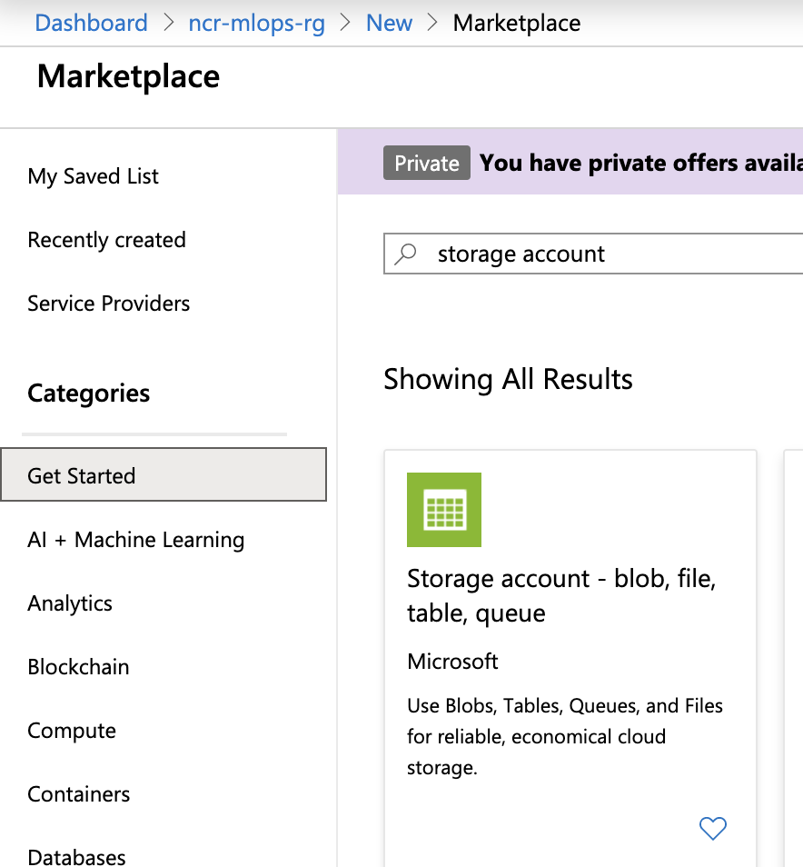
 

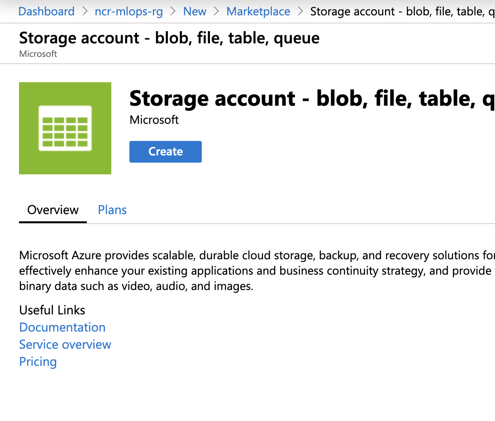
 

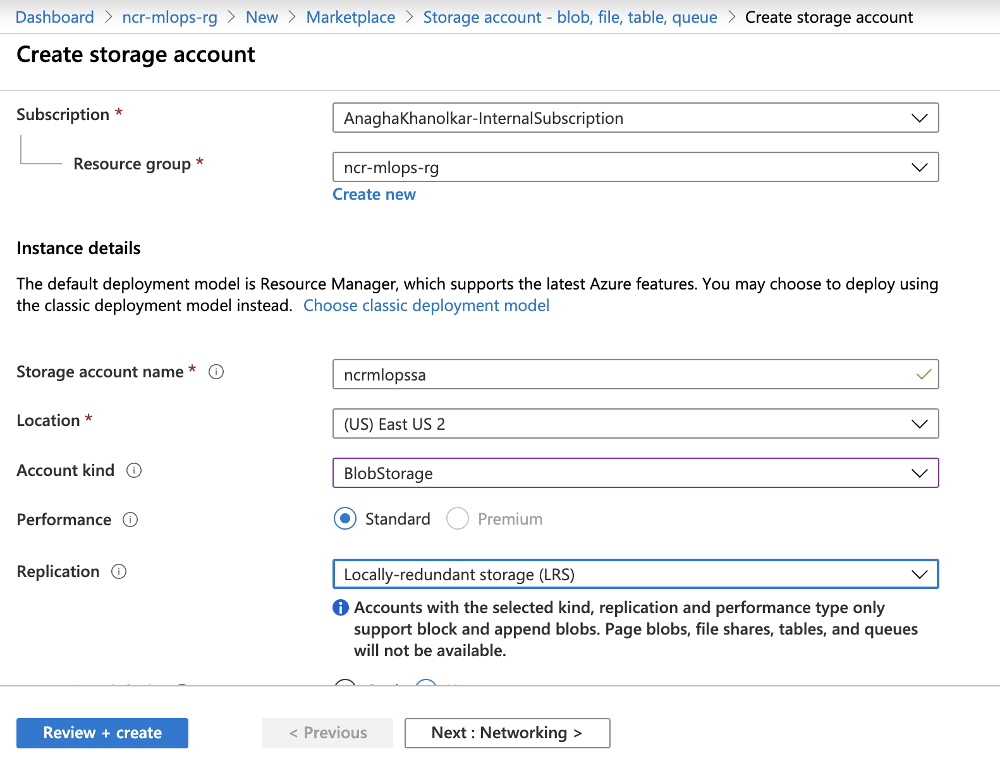
 

 

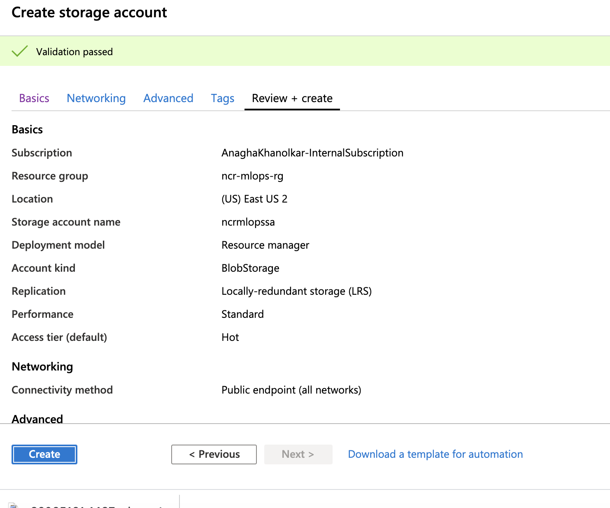
 

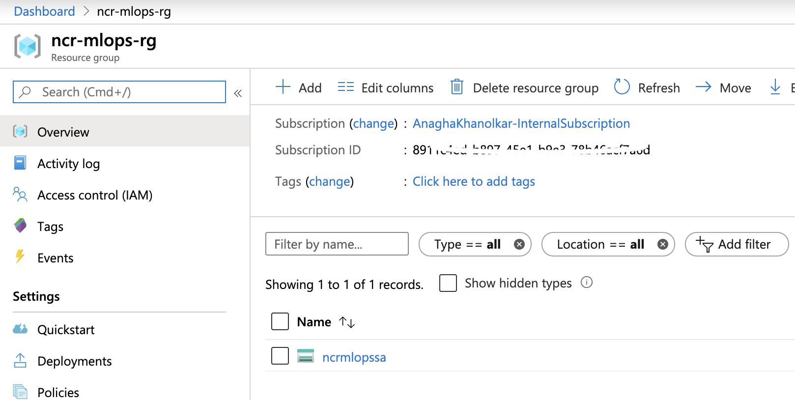
 

 

## 5.0. Provision an Azure Devops Repository
Go to dev.azure.com  

1.  Create a new project 
2.  Enter details as depicted below  

 

 

 

 

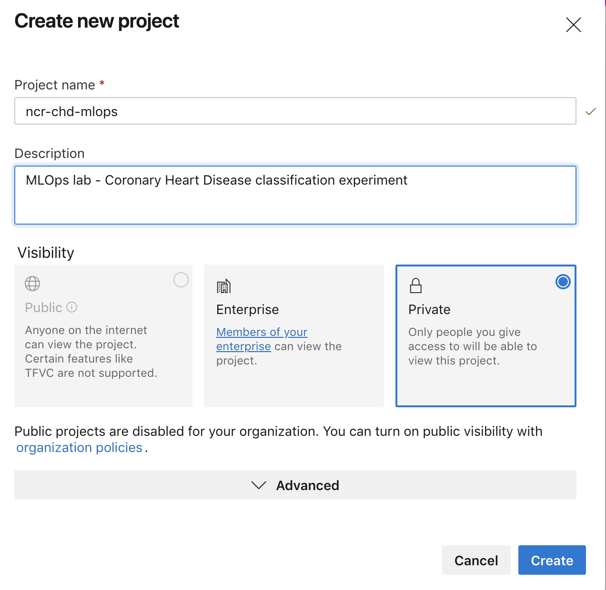
 

 

## Next steps
Move to the next module -> download notebooks and datasets
