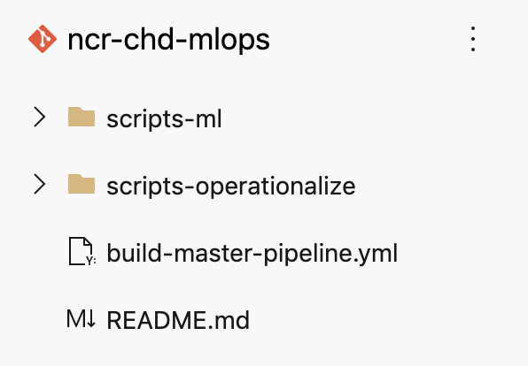
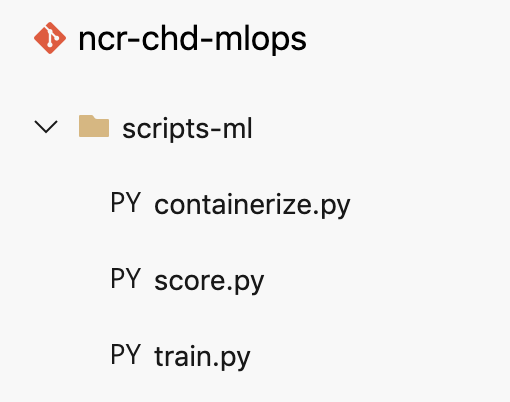
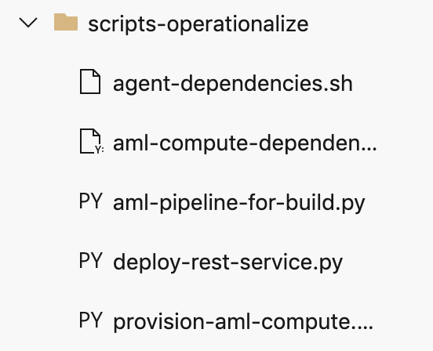

## About
This section lists what the various files are and the part each one plays in the MLOps process.  Expect to spend time to review the files independently in depth for greater understanding.

 
Suggested time committment for thorough review is 60 minutes.

## 1.  Code layout 

1.  Here is the layout: 

 

 

2. Code authored by the data scientist: 

 

 

3.  Code authored by the devops engineer: 

 

 

 

 

## 2.  build-master-pipeline.yml (Build pipeline YAML)
1.  This is a script authored by the DevOps engineer typically 
2.  It describes trigger for the pipeline, variables and pipeline steps in the order to be executed - it calls additional scripts to be executed. 

## 2.  train.py (Model training script)
1.  This script is authored by the data scientist
2.  It trains the model and checks it into the AML model registry. 
3.  It is called in the build pipeline

## 3.  containerize.py (Container image creation script)
1.  This script is authored by the data scientist
2.  It creates a docker container with dependencies and model packed in and checks it into the AML container registry
3.  It is called in the build pipeline

## 4.  score.py (REST API based scoring script)
1.  This script is authored by the data scientist
2.  It processes a scoring request by calling the REST service and returns a prediction
3.  It is deployed in the release pipeline

## 5.  agent-dependencies.sh
1.  This script is authored by the devops engineer in consultation with the data scientist
2.  It installs software dependencies for MLOps on the agents
3.  It is leveraged in the build and release pipelines

## 6.  aml-compute-dependencies.yml
1.  This script is authored by the devops engineer in consultation with the data scientist
2.  It installs software dependencies for MLOps on training compute instances
3.  It is leveraged in the build pipeline

## 7.  aml-pipeline-for-build.py
1.  This script is authored by the devops engineer in consultation with the data scientist
2.  It creates an AML pipeline with stages in it and executes it
3.  It is leveraged in the build pipeline

## 8.  provision-aml-compute.py
1.  This script is authored by the devops engineer in consultation with the data scientist
2.  It provisions transient AML compute for model training
3.  It is leveraged in the build pipeline

## 9.  deploy-rest-service.py
1.  This script is authored by the devops engineer in consultation with the data scientist
2.  It provisions an AKS cluster and a REST service on the same leveraging the container image and scoring file
3.  It is leveraged in the release pipeline

## Recap
Its a wrap for this module.  In this module you learned what each script/file in the MLOps lab does.

## Next
Navigate to the next module where you will learn to create and execute a build pipeline
 
[Configure and test a build pipeline](https://github.com/anagha-microsoft/ncr-mlops-hol/blob/master/lab-guide/10-Configure-Build-Pipeline.md)

