# Module 10 - Configure and run the build pipeline in Azure DevOps

## About
This module covers configuring a build pipeline and executing it, and finally renaming it to something meaningful
  Dedicate 120 minutes for this module - to thoroughly understand and execute

## 1.0. Navigate to pipelines and create a build pipeline

 

 

1) Select existing Azure Pipelines YAML as the base

 

 

2) Select the YAML file

 

 

3) Edit the YAML file to update it with your details
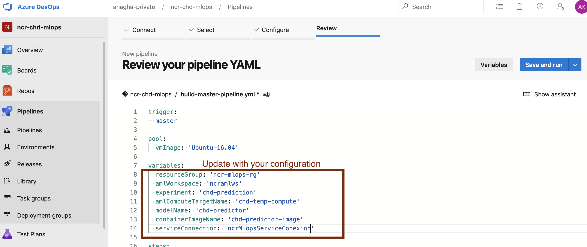
 

 

4) Save and run with commit to master branch

 

 

5) You should see the pipeline starting

 

 

6) Browse around; The pipeline takes 30 minutes to run.

 

 

7) Browse around...

 

 

8) Browse around...

 

 

9) Browse around...
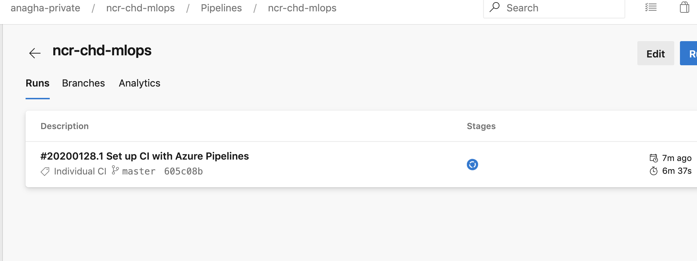
 

 

10) Browse around...

 

 

11) Note the steps executing...

 

 

12) Verify if the transient compute got created... 
Note that it does not have "manual" keyword in it

 

 

13) Verify if the experiment got created... 
Note that it does not have "manual" keyword in it

 

 

14) Notice that there are multiple runs 

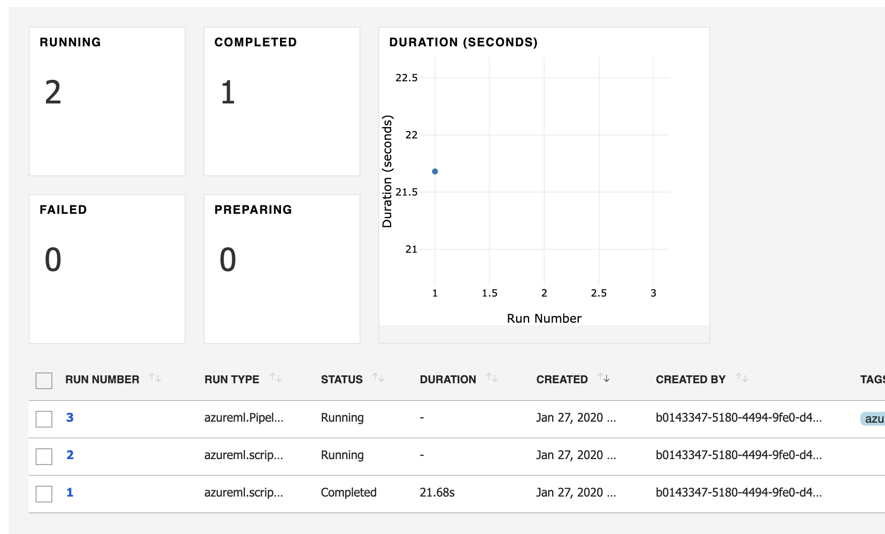
 

 

15) Run 1 for provisioninhg the training compute 

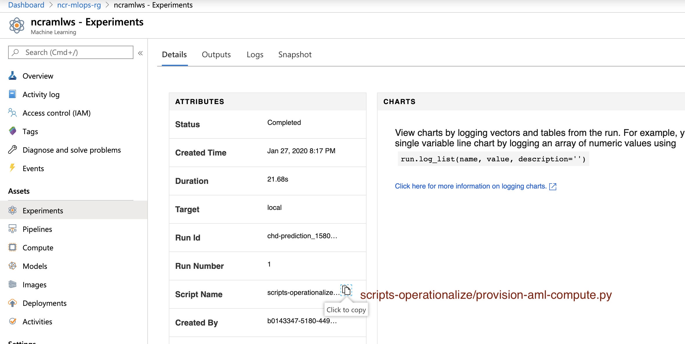
 

 

16) Here is run 2 
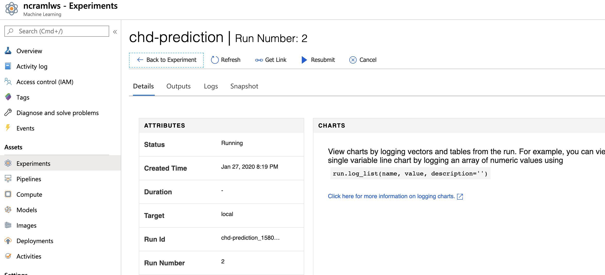
 

 

17) Run 2 is the build pipeline 

 

 

18) Here is run #3 

 

 

19) Its the model training step.  Click on the runID link.. 

 

 

20) Click on the link to the training compute 

 

 

21) Fancy new AML UI that shows the transient compute state 
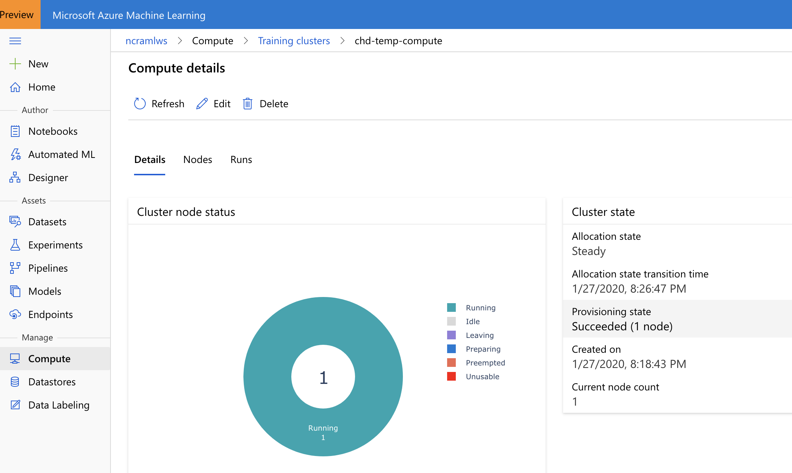
 

 

22) Observe the steps 
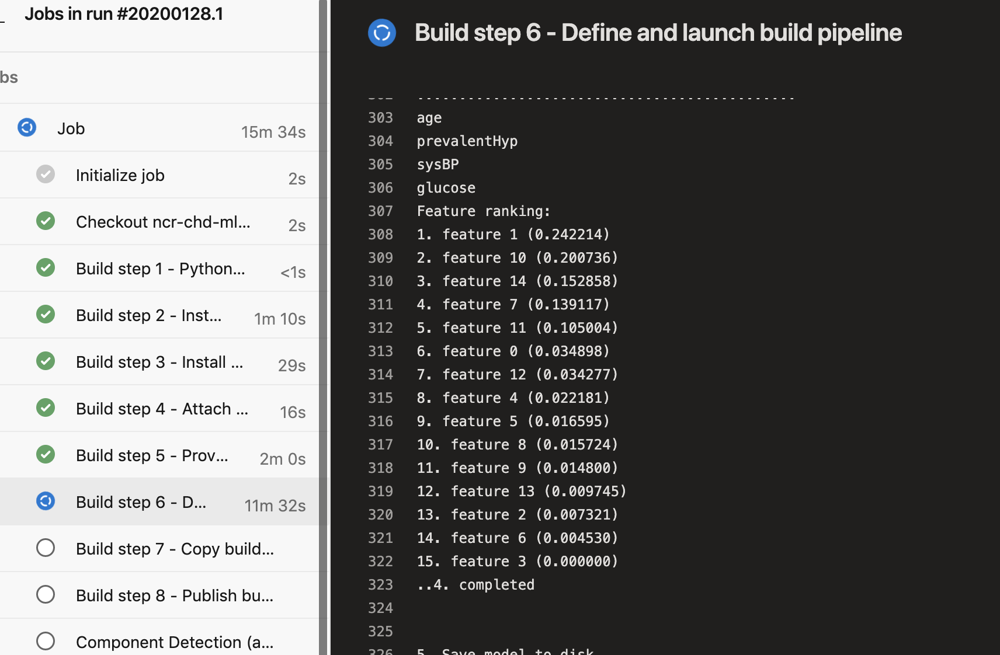
 

 

23) Look at the detailed log on the right.  MNot optimal for production, but great for learning MLOps. 
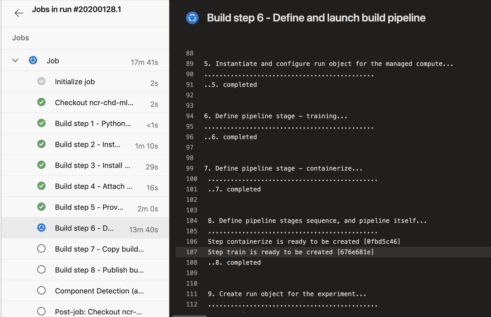
 

 

24) Where are we now? 
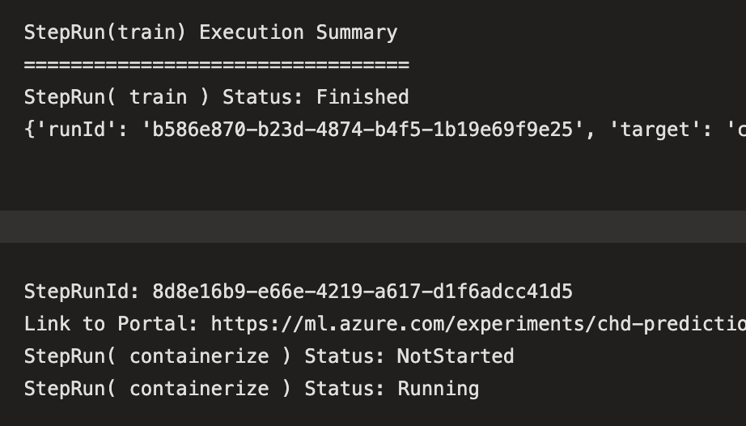
 

 

25) Inside containerize.py 

 

 

26) Determine if the model makes the cut to be deployed.. 
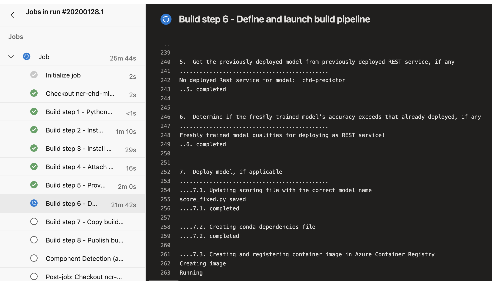
 

 

27) Registering container image 
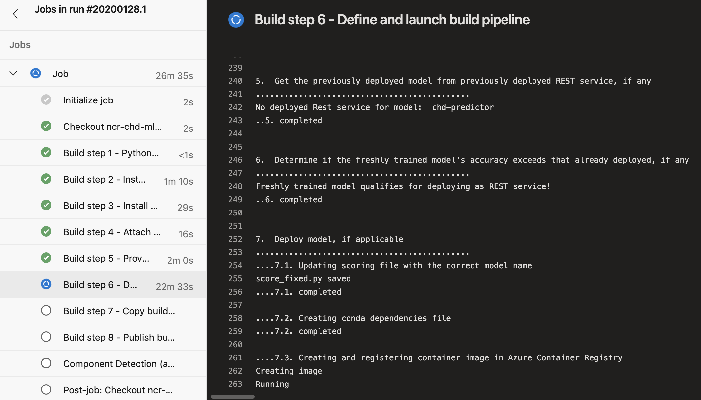
 

 

28) Check on the portal AML workspace for impage registration 

 

 

29) Back in the main master build pipeline 
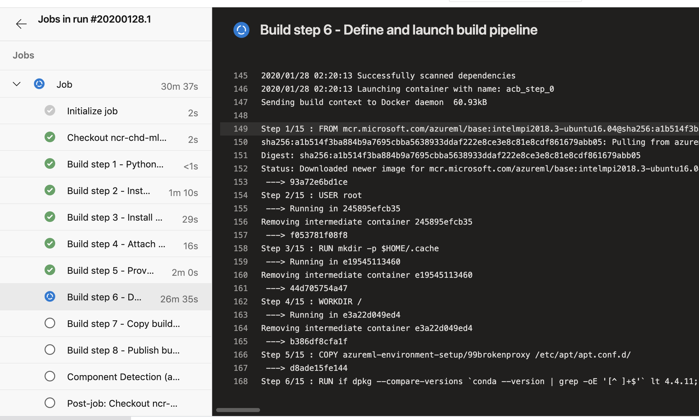
 

 
