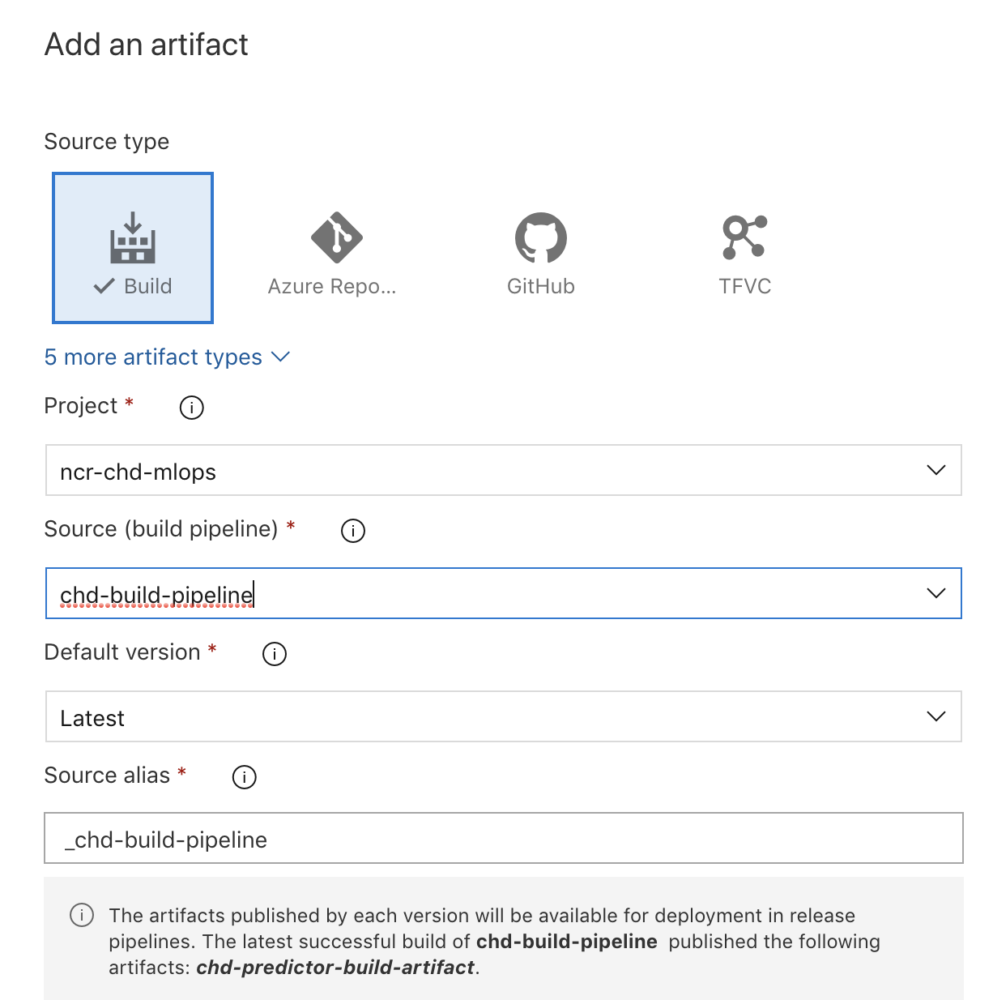
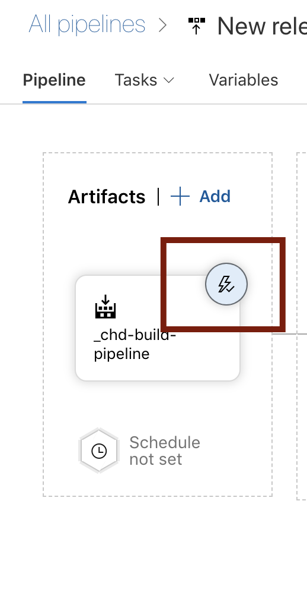
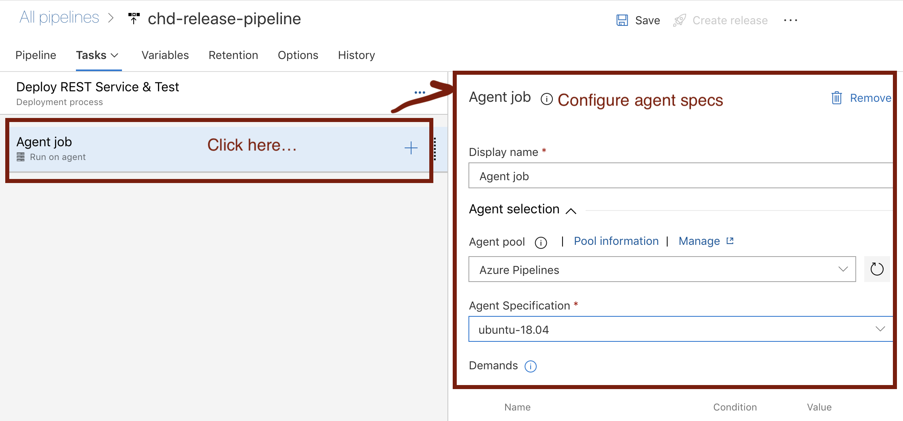
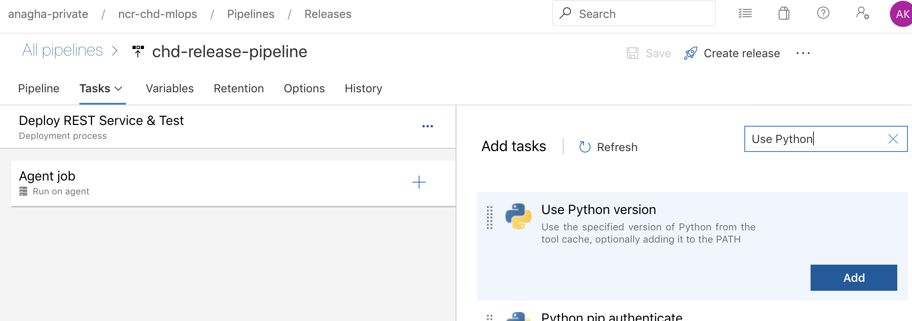
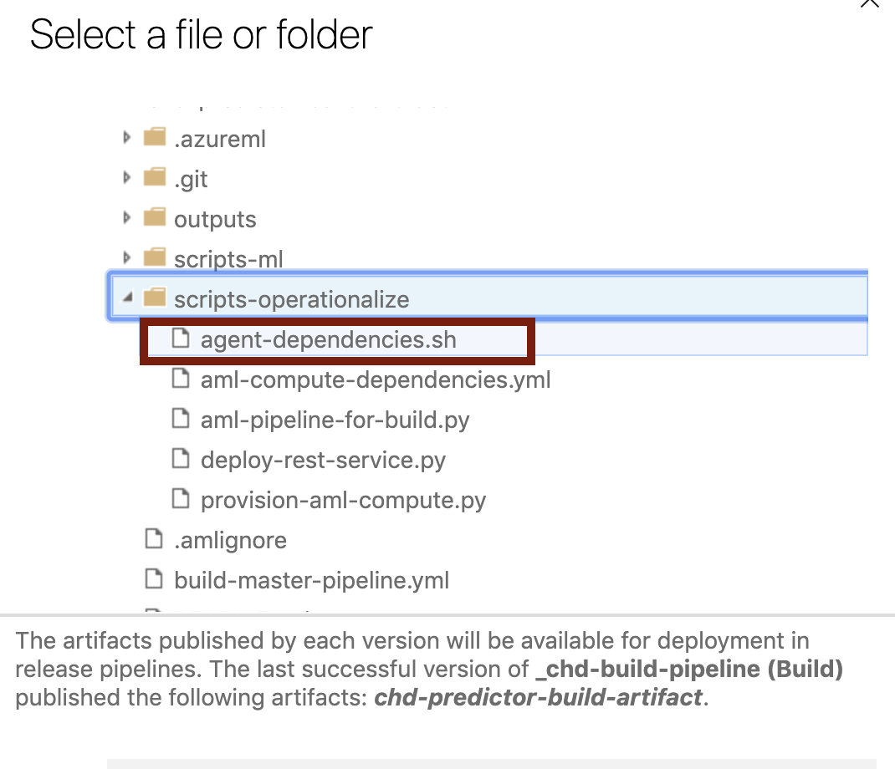
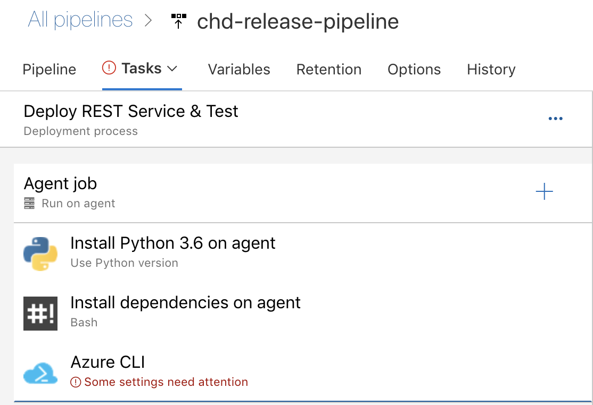

# Module 11 - Configure and run the release pipeline in Azure DevOps

## About
This module covers configuring a release pipeline and executing it.  It also covers study of the AML assets created as part of the pipeline execution.
  Dedicate 60-90 minutes for this module - to thoroughly understand and execute

## 1.0. Create a release pipeline in Azure DevOps

1) Create a new release pipeline by clicking on the button

 

 

2) Click on "Empty job"

 

 

3) Name the stage "Deploy REST Service & Test"

 

 

4) We will add a build artifact

 

 

5) Click on "Build" and fill in details

 

 

6) Next we will configure a trigger for continuous deployment

 

 

7) Complete the configuration as depicted

 

 

8) You are still in the process of configuring a trigger

 

 

9) Save

 

 

10) You should see a circle around the thunderbolt incon to reflect (visually) that its configured

 

 

11) Rename pipeline to something meaningful

 

 

12) Click on "Tasks", then on "Agent job" and configure agent specs as shown in screenshot

 

 

13) Ensure artifact config is as shown

 

 

14) Save

 

 

15) Add a task to the "Agent job" by clicking on the "+"

 

 

16) Add a "Use Python task"

 

 

17) Configure as shown below

 

 

18) Save

 

 

19) Add another agent job task

 

 

20) Select "bash" this time

 

 

21) 

 

 

22) 

 

 

23) 

 

 

24) 

 

 

25) 

 

 

26) 

 

 

27) 

 

 

28) 

 

 

29) 

 

 

30) 

 

 

## Recap
Its a wrap for this module.  You now know how to (1) ..

## Next steps
Move to the next module -> this covers testing the REST service operationalized as part of the release pipeline, manually, in a Jupyter notebook
